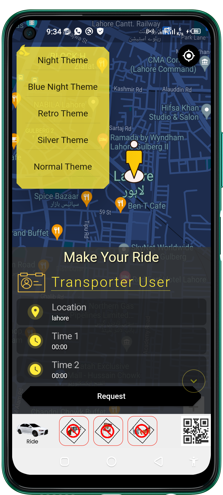

# privates_repository
that's during developed or others

# Shipper App 
 <table style='border:none;width:100%'>
  <td style='width:24%;'>
    1. Intro
   
  </td>
  <td style='width:24%;'>
    2. HomePage
  
  </td>
   <td style='width:24%;'>
    3. DetailsPage
  
  </td>
   </td>
   <td style='width:24%;'>
    3. Content Upload screen
  
  </td>
</table>
# Shipper App 
 <table style='border:none;width:100%'>
  <td style='width:24%;'>
    1. Intro
   
  </td>
  <td style='width:24%;'>
    2. HomePage
  
  </td>
   <td style='width:24%;'>
    3. DetailsPage
  
  </td>
   </td>
   <td style='width:24%;'>
    3. Content Upload screen
  
  </td>
</table>
 <table style='border:none;width:100%'>
  <td style='width:24%;'>
    1. Intro
   
  </td>
  <td style='width:24%;'>
    2. HomePage
  
  </td>
   <td style='width:24%;'>
    3. DetailsPage
  
  </td>
   </td>
   <td style='width:24%;'>
    3. Content Upload screen
  
  </td>
</table>
# MallMaweshi App 
 <table style='border:none;width:100%'>
  <td style='width:24%;'>
    1. Intro
   
  </td>
  <td style='width:24%;'>
    2. HomePage
  
  </td>
   <td style='width:24%;'>
    3. DetailsPage
  
  </td>
   </td>
   <td style='width:24%;'>
    3. Content Upload screen
  
  </td>
</table>

# Chat Gpt
 <table style='border:none;width:100%'>
  <td style='width:24%;'>
   
  </td>
  <td style='width:24%;'>
  
  </td>
   <td style='width:24%;'>
  
  </td>
   </td>
   <td style='width:24%;'>
<!--     4.  -->
<!--    -->
  </td>
</table>

# Scanner & All Code Generator
 <table style='border:none;width:100%'>
  <td style='width:24%;'>

   
  </td>
  <td style='width:24%;'>

  
  </td>
   <td style='width:24%;'>

  
  </td>
   </td>
   <td style='width:24%;'>

  
  </td>
</table>

# Shoes Store App
 <table style='border:none;width:100%'>
  <td style='width:24%;'>

   
  </td>
  <td style='width:24%;'>

  
  </td>
   <td style='width:24%;'>

  
  </td>
   </td>
   <td style='width:24%;'>

  
  </td>
</table>

# PolyFi Rides App
<table style='border:none;width:100%'>
  <td style='width:24%;'>

   
  </td>
  <td style='width:24%;'>

  
  </td>
   <td style='width:24%;'>

  
  </td>
   </td>
   <td style='width:24%;'>

  
  </td>
</table>

# Chemical App
 <table style='border:none;width:100%'>
  <td style='width:24%;'>

   
  </td>
  <td style='width:24%;'>

  
  </td>
   <td style='width:24%;'>

  
  </td>
   </td>
</table>

<!--    after this when need to show the last .......................................... last area .....................................................-->

# Changan Auto Bilal App
 <table style='border:none;width:100%'>
  <td style='width:24%;'>
   
  </td>
  <td style='width:24%;'>
  
  </td>
   <td style='width:24%;'>
    3.
  
  </td>
   </td>
   <td style='width:24%;'>
<!--     4.  -->
<!--    -->
  </td>
</table>

# Chamman Milk App
<table style='border:none;width:100%'>
  <td style='width:24%;'>
    1. HomePage
   
  </td>
  <td style='width:24%;'>
    2. DetailsPage
  
  </td>
   <td style='width:24%;'>
    3. Biling Details
  
  </td>
   </td> 
   <td style='width:24%;'>
    3. Review
  
  </td>
</table>

# TreatSick with Medicine Suggetions app
<table style='border:none;width:100%'>
  <td style='width:24%;max-width:25%;'>
   
  </td>
  <td style='width:24%;max-width:25%;'>
  
  </td>
  <td style='width:24%;max-width:25%;'>
   
  </td>
  <td style='width:24%;max-width:25%;'>
  
  </td>
</table>

# H2O Multi Services With Laravel Api
<table style='border:none;width:100%'>
  <td style='width:24%;max-width:25%;'>
   
   
  </td>
  <td style='width:24%;max-width:25%;'>
    
  
  </td>
  <td style='width:24%;max-width:25%;'>
    
  
  </td>
  <td style='width:24%;max-width:25%;'>
  
  </td>
</table>

# Blood Saver With Laravel Api
<table style='border:none;width:100%'>
  <td style='width:24%;max-width:25%;'>
  
   
  </td>
  <td style='width:24%;max-width:25%;'>
  
  
  </td>
  <td style='width:24%;max-width:25%;'>
  
  </td>
  <td style='width:24%;max-width:25%;'>
   
  
  </td>
</table>

# 6 mart With Api structure
 we only fix bugs its by clients
<table style='border:none;width:100%'>
  <td style='width:24%;max-width:25%;'>
  
   
  </td>
  <td style='width:24%;max-width:25%;'>
  
  
  </td>
  <td style='width:24%;max-width:25%;'>
    =
  
  </td>
  <td style='width:24%;max-width:25%;'>
   
  
  </td>
</table>

# Charge UR Self App For Charging Station Project
 <table style='border:none;width:100%'>
  <td style='width:24%;'>
   
   
  </td>
  <td style='width:24%;'>
    
  
  </td>
   <td style='width:24%;'>
    
  
  </td>
   </td>
   <td style='width:24%;'>
  
  
  </td>
</table>
